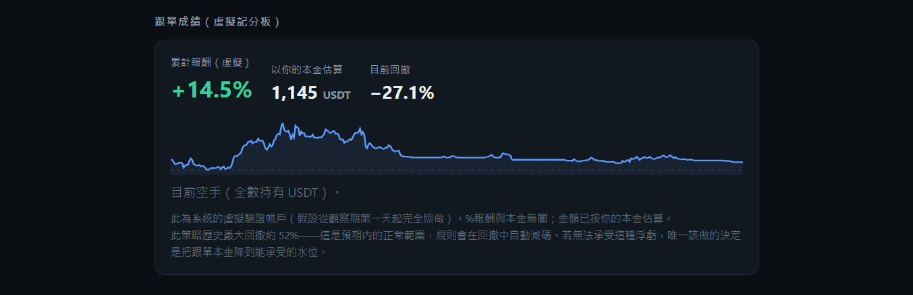
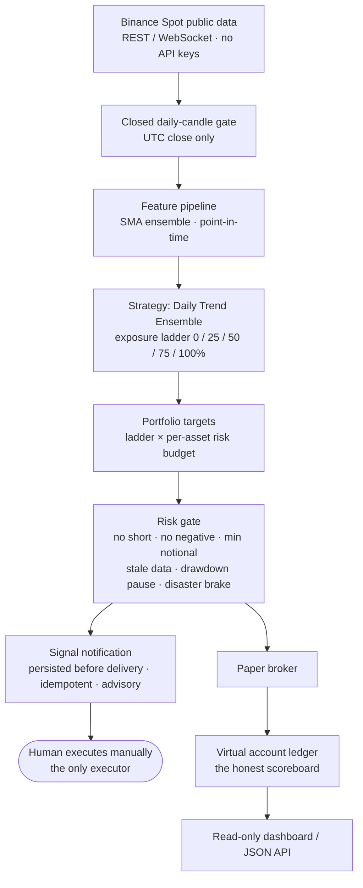
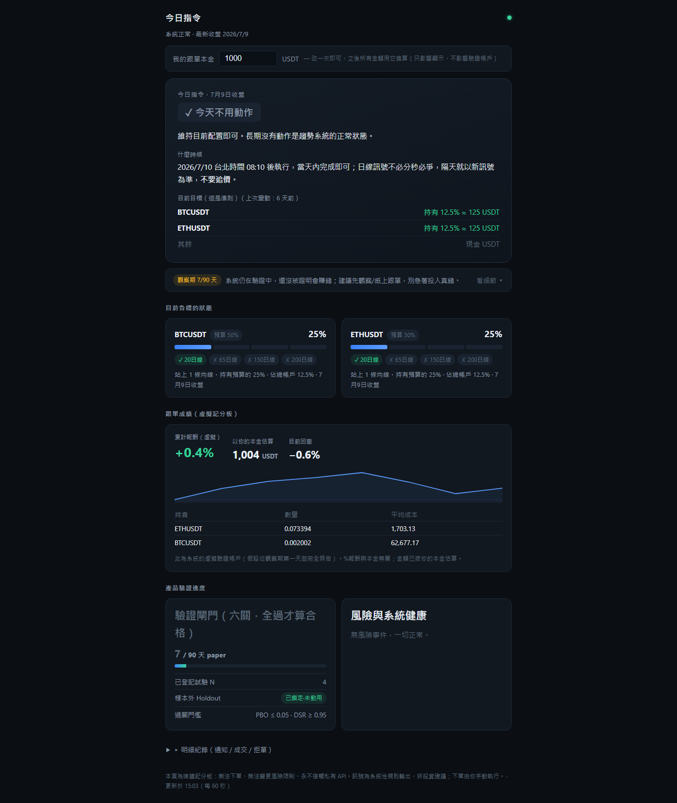

# Crypto Quant Signal MVP

[](https://github.com/0Smallcat0/crypto-quant-signal/actions/workflows/ci.yml)
[](https://www.python.org/downloads/)
[](https://mypy.readthedocs.io/)
[](https://github.com/astral-sh/ruff)
[](LICENSE)

**A trading-signal system engineered to prove itself wrong before anyone risks money on it.**

Most strategy repos exist to convince you they work. This one runs its own strategy through a six-gate falsification pipeline — registered trials, deflated Sharpe, a single-use locked holdout, ninety days of live paper trading — and publishes the scoreboard either way. A sibling strategy family has [already been killed by its own pre-registered gate](https://github.com/0Smallcat0/tw-stock-trading).

Concretely, it is a crypto **spot, long-only, public-data, daily signal** notification system with an honest paper-trading scoreboard. Every day after the UTC close, the system decides what to buy or sell and why, and notifies the user — **the user executes manually**. A `1000 USDT` virtual account follows every signal in parallel as the scoreboard, recording virtual decisions, orders, fills, positions, cash, PnL, rejected orders, and risk events.

The system **never submits real exchange orders, never reads private balances, and never requires API keys — permanently, by product definition.** The human is the only executor.

> ⚠️ **Disclaimer:** This is a research and paper-trading project. It is **not financial advice**, produces no guaranteed returns, and executes no real trades. Signals are advisory output only.

---

## Try it in two minutes

No API keys, no Docker, no network — the repo bundles 2.5 years of real BTC/ETH daily candles (2024-01 → 2026-06) and replays them through the exact engine the live qualification run uses:

```bash
git clone https://github.com/0Smallcat0/crypto-quant-signal
cd crypto-quant-signal
python -m venv .venv && source .venv/bin/activate   # Windows: .venv\Scripts\activate
pip install -e .
python -m scripts.run_demo
```

You get the full scoreboard in seconds — 713 daily decision cycles, 248 ladder commands, every paper fill with fees and slippage — and the read-only dashboard at `http://127.0.0.1:8010`:

```json
{
  "cycles_processed": 713,
  "notifications": 248,
  "fills": 248,
  "initial_cash": "1000",
  "final_equity": "1145.05288738567",
  "return_pct": "14.5"
}
```

That `+14.5%` ends inside a `−27.1%` drawdown, because the bundled window ends in a bear stretch. The demo does not cherry-pick a flattering period — honest output is the whole point of this project.



---

## Why this project is interesting

Most retail "trading bot" repos backtest a strategy until the equity curve looks good and call it done. This project is built around the opposite thesis: **a strategy earns belief by surviving verification, not by looking good in-sample.** The engineering reflects that.

- **A real anti-overfitting validation gate**, not a single backtest. Six gates must pass before any signal is called "qualified":
  1. **Trial registry** — every backtest run is recorded; unregistered results are void by construction.
  2. **Data floor** — ≥1,000 daily observations spanning bull, bear, and recovery.
  3. **PBO ≤ 0.05** via CSCV (S=16 blocks, 12,870 splits) — probability of backtest overfitting.
  4. **DSR ≥ 0.95** — Deflated Sharpe Ratio adjusted for the effective number of trials.
  5. **Single-use locked holdout** — the most recent ~12 months, locked at first backtest, spendable exactly once. Iterated out-of-sample is not out-of-sample.
  6. **≥3 months paper trading** with measured real costs within 1.5× the assumption.

  ```mermaid
  flowchart LR
      BT["Every backtest run"] --> G1["1 · Trial registry<br/>unregistered = void"]
      G1 --> G2["2 · Data floor<br/>≥ 1,000 daily obs"]
      G2 --> G3["3 · PBO ≤ 0.05<br/>CSCV, S=16"]
      G3 --> G4["4 · DSR ≥ 0.95<br/>deflated for N trials"]
      G4 --> G5["5 · Locked holdout<br/>single-use, irreversible"]
      G5 --> G6["6 · ≥ 3 months paper<br/>real costs ≤ 1.5× assumed"]
      G6 --> OK(["Qualified signal"])
      G2 & G3 & G4 & G5 & G6 -. any failure .-> BACK["Strategy family goes<br/>back to research"]
  ```

  The gate machinery (trial registry, CSCV/PBO, DSR, holdout lock) is also extracted as a standalone zero-dependency package: [**trialgate**](https://github.com/0Smallcat0/trialgate). The same gates have one registered FAIL on record — the [Taiwan-market adaptation](https://github.com/0Smallcat0/tw-stock-trading) of this strategy family, killed by its own pre-registered claim.
- **Safety encoded in the type system.** `Signal` is `LONG`/`FLAT` only — `SHORT` is unrepresentable. Position quantities can't go negative. Money is `Decimal`. Timestamps are UTC-aware; naive datetimes are rejected.
- **Restartable, idempotent runtime.** Notifications and virtual orders are duplicate-proof across restarts via idempotency keys; every fill embeds a state checkpoint so a crash between a fill and the end-of-cycle snapshot can't lose the fill.
- **No-lookahead by design and by test.** Decisions use only closed daily candles; a signal from candle `t` can never fill on candle `t`; features at close `t` use only closes ≤ `t`. Tests prove each rule.
- **Enforced architecture boundaries.** `import-linter` keeps the domain layer dependency-free and prevents business packages from reaching into each other; `mypy --strict` over all of `src/`.

Each of these is a deliberate trade-off with a verifiable paper trail — problem, decision, and exactly where to check it: [**docs/ENGINEERING_DECISIONS.md**](docs/ENGINEERING_DECISIONS.md).

## The strategy

`Daily Trend Ensemble` — a readable, long-only time-series trend rule. Per asset, target exposure equals the fraction of four SMAs (20 / 65 / 150 / 200-day) the close sits above → a `{0, 25, 50, 75, 100}%` exposure ladder.

```
Check once per day after the UTC daily close.
Ladder up when more trend lines are reclaimed.
Ladder down toward cash when they break.
No shorting. No dip-buying. No cross-sectional rotation.
Long silences are correct behavior — a handful of signals per year is expected.
```

The four lookbacks are **contract-fixed** (`docs/contracts/STRATEGY_DAILY_TREND_ENSEMBLE.md`). Changing them is a new strategy variant that must be pre-registered in the trial registry and counts toward the overfitting math — you cannot quietly tune parameters into looking good.

## Architecture



Responsibilities stay separated: **strategy** decides what looks attractive, **portfolio** decides how much, **risk** decides whether it's allowed, **paper broker** simulates execution, **accounting** records what happened. Composition lives only in `src/backtest/` and `src/runtime/`.

## The scoreboard dashboard

Live view of the qualification run: today's command card, per-asset ladder state, the virtual account's equity curve, and validation-gate progress (registered trials, holdout lock status, paper-day counter). The UI is in Traditional Chinese — it is the single operator's daily instrument, not a public product.



## Project status

The Core MVP is **complete and verified** (foundation → daily strategy → backtest + validation-gate tooling → signal runtime → read-only dashboard). The project is currently in the post-MVP **signal-live qualification** phase (Goal O): spending the single-use holdout and running the ≥3-month paper trade before publishing a pass/fail gate report.

- **312 passing tests** across 28 files, ~85% line coverage (`pytest -m "not network"`, no external network in CI).
- **39 source modules**, ~9,300 lines, `mypy --strict` clean, 13 enforced import-linter contracts.
- Full goal roadmap and rationale: [`GOALS.md`](GOALS.md). Agent/contributor contract: [`AGENTS.md`](AGENTS.md). Design evidence: [`docs/research/SIGNAL_DESIGN_RESEARCH.md`](docs/research/SIGNAL_DESIGN_RESEARCH.md) ([English summary](docs/research/SIGNAL_DESIGN_RESEARCH_EN.md)).

## Tech stack

Python 3.12 · FastAPI + Jinja/static dashboard · Pydantic config · Binance Spot public market data · append-only JSONL event store (a PostgreSQL/TimescaleDB dev container is configured but not yet wired into the runtime) · pytest · mypy (strict) · ruff · import-linter · Docker Compose.

## Local setup

Python 3.12 is required. On Windows:

```powershell
py -3.12 -m venv .venv
.\.venv\Scripts\python.exe -m pip install --upgrade pip
.\.venv\Scripts\python.exe -m pip install -e ".[dev]" -c requirements\constraints-dev.txt
```

Start the local event store (dummy dev credentials only — see below):

```powershell
docker compose up -d --wait
```

## Verification

```powershell
.\.venv\Scripts\python.exe -m ruff check .
.\.venv\Scripts\python.exe -m ruff format --check .
.\.venv\Scripts\python.exe -m mypy --strict src/
.\.venv\Scripts\lint-imports
.\.venv\Scripts\python.exe -m pytest -m "not network" tests -q
```

Public-network smoke tests hit Binance and are excluded from the default run; they are explicitly marked `pytest.mark.network`.

## Running it

```powershell
# Offline demo: bundled candles -> real engine -> dashboard (no keys, no network)
.\.venv\Scripts\python.exe -m scripts.run_demo

# One paper-runtime cycle against live public data
.\.venv\Scripts\python.exe -m scripts.run_paper_runtime --once

# Backtest with trial registration + validation-gate metrics
.\.venv\Scripts\python.exe -m scripts.run_backtest

# Read-only dashboard (http://127.0.0.1:8010)
.\.venv\Scripts\python.exe -m scripts.run_dashboard --store data/runtime/events.jsonl --port 8010
```

## Repository layout

```
src/
  domain/        shared types (LONG/FLAT signal, Decimal money, UTC time)
  data/          Binance Spot public client, closed-candle gate, quality checks
  features/      daily SMA ensemble, point-in-time feature snapshots
  strategies/    Daily Trend Ensemble (active) + Large Liquid Trend 15 (inactive reference)
  portfolio/     exposure ladder → target weights within risk budgets
  risk/          risk gate + disaster event
  execution/     paper broker
  accounting/    virtual account ledger
  notify/        persisted, idempotent notification events
  backtest/      replay engine, trial registry, holdout lock, CSCV/PBO + DSR
  runtime/       signal runtime loop, event store, exec-quote capture
  api/           read-only FastAPI dashboard
configs/         runtime YAML config
demo/candles/    bundled BTC/ETH daily candles for the offline demo
docs/
  contracts/     strategy / risk / validation-gate specifications
  research/       adversarially verified signal-design research
  reports/        completion + audit reports, trial provenance
tests/           312 tests mirroring the src layout
```

## Local database credentials

`docker-compose.yml` uses explicit **dummy development credentials** bound to `localhost:54320`:

| | |
|---|---|
| Database | `crypto_quant` |
| User | `crypto` |
| Password | `crypto_dev_only` |

These are local Docker credentials, **not production secrets**. The application requires no API keys of any kind.

## License

[MIT](LICENSE) © 0Smallcat0
